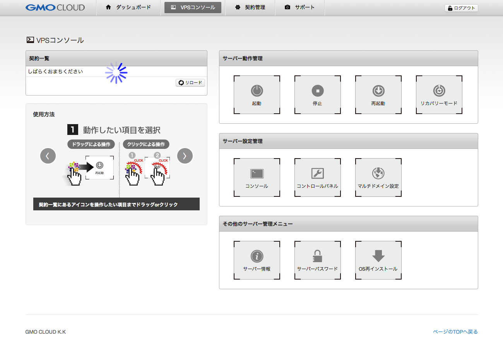
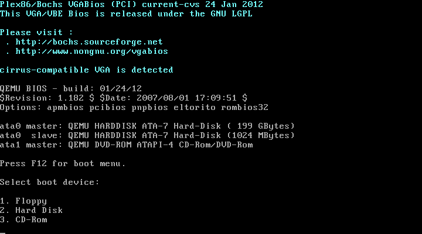
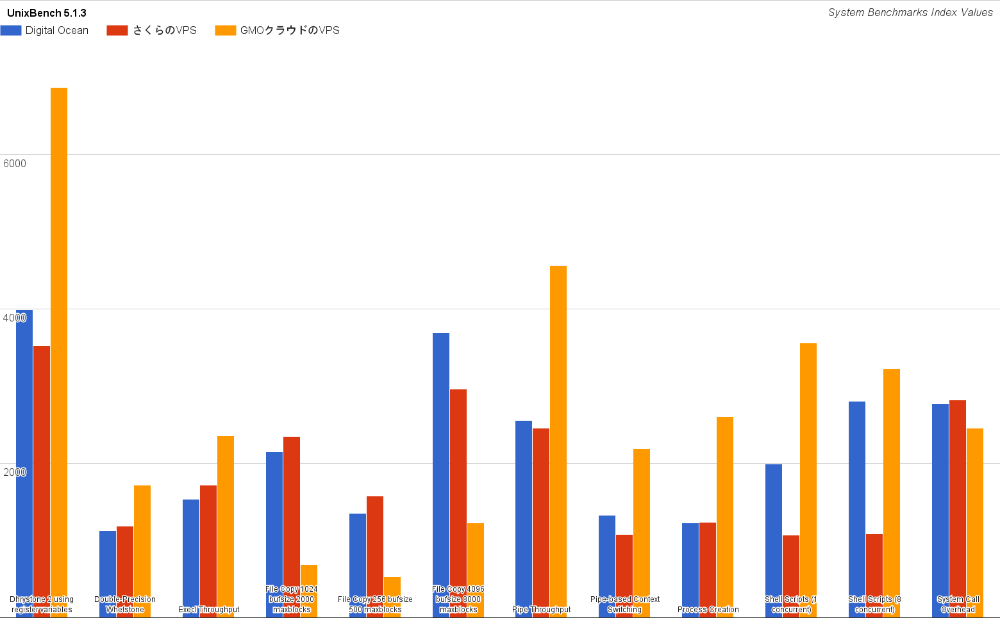

# GMOクラウドのVPSにDebian 8 (jessie)をインストールした話

こんにちは，（´・ω・） ｽの人です．
今回は「GMOクラウドのVPSにDebian 8 (jessie)をインストールした話」ということで，GMOクラウドのVPSにDebian jessieをインストールしつつベンチマークスコアを計測しました．

## GMOクラウドのVPS

GMOインターネットの子会社であるGMOクラウドが提供するVPSサービスです．
最近のプレスリリースでは「国内最安級の1GBプラン」「SLA99.99％」と最安値・高品質を謳っているようです．

### 国内最安級は伊達じゃない

OpenVZ系を除く国内外の有名どころが提供するメモリー4GBのプランをいくつか表にまとめました．
メモリー1GBのプランが国内最安級であるかどうかはさておき，4GBのプランでは明らかに安価なグループに含まれます．
（検閲により削除されました）なコンテンツを配信できるVPSとしては間違いなく国内最安級でしょう．

|                                                                                                                  | CPU | Memory |          Storage          | Transfer | Price |
|:----------------------------------------------------------------------------------------------------------------:|:---:|:------:|:-------------------------:|:--------:|:-----:|
| [Vultr](http://www.vultr.com/?ref=6842870 "Vultr")                                                               |  2  |  4 GB  |         SSD: 90 GB        |   4 TB   | $40 |
| [DigitalOcean](https://www.digitalocean.com/?refcode=72e64693e334 "DigitalOcean")                                |  2  |  4 GB  |         SSD: 60 GB        |   4 TB   | $40 |
| [お名前.com VPS](http://px.a8.net/svt/ejp?a8mat=2HSAZJ+EWFKTU+50+35KNCY "お名前.com VPS")                        |  4  |  4 GB  |        HDD: 400 GB        |     -    | ¥3696 |
| [さくらのVPS](http://px.a8.net/svt/ejp?a8mat=2HSAZJ+C37VZM+D8Y+BWVTE "さくらのVPS")                               |  4  |  4 GB  | SSD: 100 GB / HDD: 400 GB |     -    | ¥3600 |
| [ConoHa](https://www.conoha.jp/referral/?token=xj7pqnWOX_JUrYOd7lS369L_7N.JvUj_T7CwbuqgoNkOYxCZvhg-KWQ "ConoHa") |  4  |  4 GB  |         SSD: 50 GB        |     -    | ¥3420 |
| [GMOクラウドのVPS](http://px.a8.net/svt/ejp?a8mat=2HSAZJ+C5LMEQ+2KX0+5YJRM "GMOクラウドのVPS")                   |  4  |  4 GB  |        HDD: 200 GB        |     -    | ¥2380 |

### 長所

 * CPUの性能が優れている（DigitalOcean < さくらのVPS < GMOクラウドのVPS）
 * 安価（OpenVZ系を除く）

### 短所

 * VPSコンソール(Web UI)のレスポンスが悪い
 * ディスクI/Oが遅い(HDDとSSDと比べれば当然の話ですが)
 * 用意されたOSイメージが古い(Debian 6.0 / Ubuntu 12.04)
 * 起動順位の闇

#### VPSコンソールのレスポンスが悪い

[](2015-06-23/gmo-vps-1.png)

契約しているVPSの一覧を取得するのに10秒以上かかる時があるなど全ての操作がモッサリしているように感じました．
ストレスフルなWUIを本当にありがとうございました．
VPSを操作するためのAPIが公開されればもう少し便利になるかもしれません．

#### 起動順位の闇

[](2015-06-23/gmo-vps-2.png)

GMOクラウドのVPSではシステムやデータ用の1番目ストレージとSWAP専用の2番目のストレージが提供されます．
1番目もしくは2番目のストレージのMBRからブートローダーが起動すると思いきや，どちらを上書きしたとしてもデフォルトでは起動しません．
今回契約したDebian 6.0のプランでは，起動デバイスを明示していない時GRUB 0.9xが起動します．
GRUB Legacyの設定ファイルを生成するか，起動時にF12キーを押してハードディスクからの起動を明示する必要があります．

## ベンチマーク

インストール記事なのにベンチマークスコアを計測してみました．
というのも，「GMOクラウドのVPSのCPUはそこそこ良いけど，ディスクI/Oはよろしくない」という話を見聞きしたからです．
事実，体感できるほどにディスクI/Oは遅いです．これはSSDに慣れてしまうと厳しい．

### UnixBench

|     System Benchmarks Index Values    | Digital Ocean | さくらのVPS | GMOクラウドのVPS |
|:-------------------------------------:|:-------------:|:-----------:|:----------------:|
| Dhrystone 2 using register variables  |     3988.6    |     3524    |       6871       |
| Double-Precision Whetstone            |     1130.5    |    1182.6   |      1716.4      |
| Execl Throughput                      |      1532     |     1716    |      2360.5      |
| File Copy 1024 bufsize 2000 maxblocks |     2148.8    |    2351.1   |       685.2      |
| File Copy 256 bufsize 500 maxblocks   |     1352.5    |    1572.9   |       529.8      |
| File Copy 4096 bufsize 8000 maxblocks |     3693.2    |    2963.3   |      1231.3      |
| Pipe Throughput                       |     2558.9    |    2455.5   |      4563.5      |
| Pipe-based Context Switching          |      1330     |    1081.4   |      2187.5      |
| Process Creation                      |     1229.2    |    1237.4   |       2607       |
| Shell Scripts (1 concurrent)          |     1991.9    |    1070.3   |       3558       |
| Shell Scripts (8 concurrent)          |     2808.1    |    1087.2   |      3228.6      |
| System Call Overhead                  |     2775.8    |    2820.7   |      2453.6      |

[](2015-06-23/gmo-vps-3.png)

### Oracle ORION

GMOクラウドのVPSは負荷にかかわらず40Mbps 〜 60Mbpsでした．
Digital OceanやさくらのVPSの10分の1程度．
HDDなら仕様がない…

| Large/Small | Digital Ocean | さくらのVPS |
|:-----------:|:-------------:|:-----------:|
|      1      |     662.22    |    609.05   |
|      2      |     473.23    |    412.57   |
|      3      |     416.46    |    374.34   |
|      4      |     410.09    |    345.37   |
|      5      |     350.12    |    325.63   |
|      6      |     347.13    |    323.59   |
|      7      |     321.24    |    313.16   |
|      8      |     306.63    |    312.07   |
|      9      |     286.84    |    304.61   |
|      10     |     299.53    |    299.25   |

## インストール

ブートローダーの挙動が何やらおかしいのでGMOクラウドのVPSに手動でOSをインストールすることはオススメいたしかねます．
それでもインストールを進める方は以下をご覧下さい．

コントロールパネルからサブネットマスクやゲートウェイのアドレスを確認できないので，
生成されたネットワークのconfigファイルを再起動する前に必ず確認しましょう．

```bash
cat /etc/network/interfaces

# Automatically generated by GMO Cloud Public
auto lo
iface lo inet loopback

auto eth0
iface eth0 inet static
	address XXX.XXX.XXX.XXX
	netmask XXX.XXX.XXX.XXX
	broadcast XXX.XXX.XXX.XXX
	network XXX.XXX.XXX.XXX
	gateway XXX.XXX.XXX.XXX

swapoff /dev/sdb
cfdisk /dev/sdb
mkfs.ext2 /dev/sdb1
mkdir jessie
mount /dev/sdb1 jessie
cd jessie
wget http://cdimage.debian.or.jp/8.1.0/amd64/iso-cd/debian-8.1.0-amd64-netinst.iso
wget http://ftp.tsukuba.wide.ad.jp/debian/dists/jessie/main/installer-amd64/current/images/hd-media/initrd.gz
wget http://ftp.tsukuba.wide.ad.jp/debian/dists/jessie/main/installer-amd64/current/images/hd-media/vmlinuz
nano /boot/grub/menu.lst

title  jessie
root   (hd1,0)
kernel /vmlinuz
initrd /initrd.gz

reboot
```

## まとめ

GMOクラウドのVPSにDebian 8 (jessie)をインストールしましたが，
突然ストレージのサイズが1GBになったり，コントロールパネルから一切の操作を受け付けなくなったり，
色々とえらいことになりました．
何かしら別のOSをインストールしたい方は，
ISOからのインストールに対応しているサービスを使用することを強く推奨します．

世の中には様々なVPSやパブリッククラウドが存在します．
自分が何をしたいのかを明確にして，最も適したサービスを選ぶようにしましょう．
どれにも満足できなければオンプレでも…

## 参考文献

 1. [4.4. ハードディスク起動ファイルの準備](https://www.debian.org/releases/stable/amd64/ch04s04.html.ja "4.4. ハードディスク起動ファイルの準備")
 1. [5.1. 64-bit PC でのインストーラの起動](https://www.debian.org/releases/stable/amd64/ch05s01.html.ja "5.1. 64-bit PC でのインストーラの起動")


